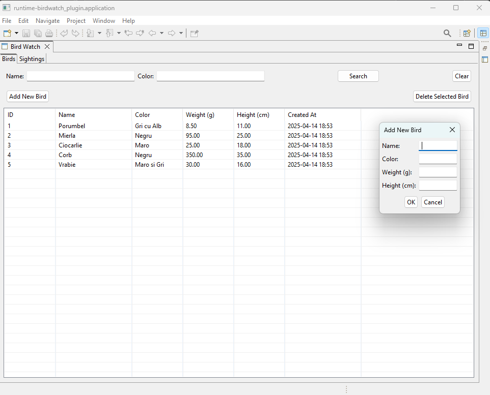
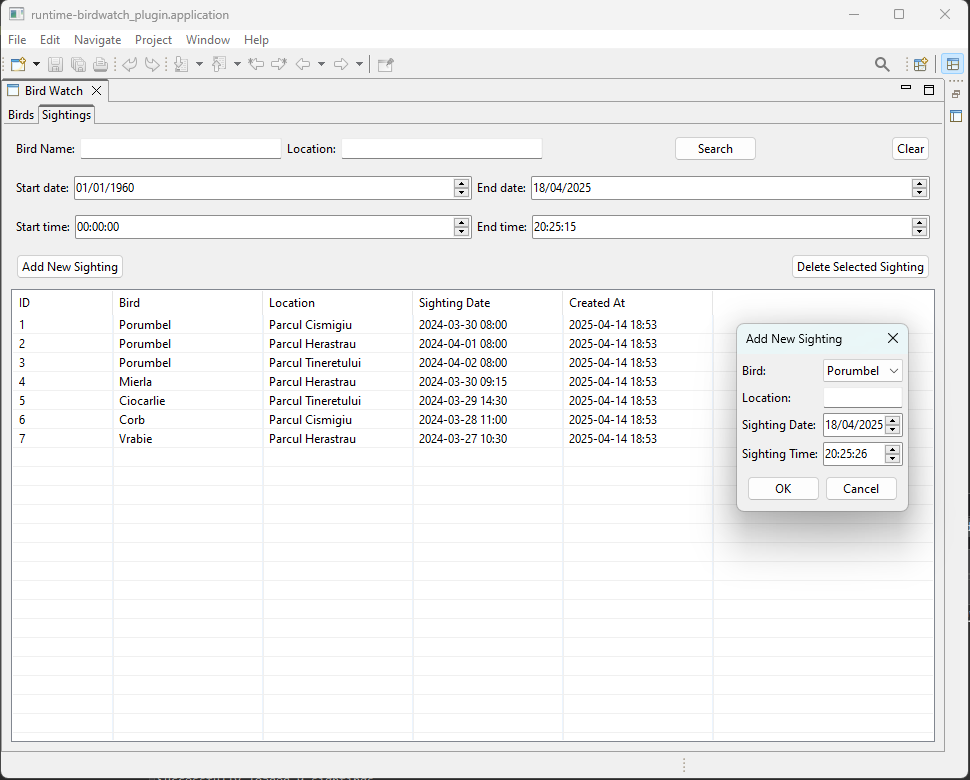

# BirdWatch Project 🦜

A simple Eclipse plugin based application for tracking and managing bird sightings.

## Getting Started 🚀

### Backend 🔧

#### Using Docker (Recommended)
1. Open a Bash Terminal in the root of the project
2. Run the start script: `./start.sh`

To stop the application: `./stop.sh`

#### Manual Docker Commands
Alternatively, you can run the Docker commands manually:
1. Open a Terminal in the root of the project and run `docker-compose build`
2. Once the project is built, run `docker-compose up -d` to start the Posgres Database and Spring API Service

To stop all of the containers, simply run `docker-compose down` or if you want to remove all the containers run `docker-compose down -v`

### Frontend 💻

1. Import the `plugin` and `plugin_api` projects into Eclipse
2. Configure your run configurations to start `birdwatch_plugin` as a `workbench` type application
3. Run the plugin

To stop the UI plugin, simply close the window

## Technologies Used 🛠️

### Backend
- Java 11
- Spring Boot 2.7.18
- Spring Data JPA
- PostgreSQL Database
- Maven
- Lombok
- Jackson (JSON processing)

### Frontend
- Eclipse RCP (Rich Client Platform)
- SWT (Standard Widget Toolkit)

### Infrastructure
- Docker
- Docker Compose
- PostgreSQL
- Bash

## API Documentation 📚

### Birds Endpoints

| Method | Endpoint | Description |
|--------|----------|-------------|
| GET    | `/api/birds` | Get all birds |
| GET    | `/api/birds/{id}` | Get a specific bird |
| GET    | `/api/birds/search?name={bird_name}` | Search birds by name |
| GET    | `/api/birds/search?color={bird_color}` | Search birds by color |
| GET    | `/api/birds/search?name={bird_name}&color={bird_color}` | Search birds by name and color |
| POST   | `/api/birds` | Create a new bird |
| PUT    | `/api/birds/{id}` | Update an existing bird |
| DELETE | `/api/birds/{id}` | Delete a bird |

### Sightings Endpoints

| Method | Endpoint | Description |
|--------|----------|-------------|
| GET    | `/api/sightings` | Get all sightings |
| GET    | `/api/sightings/{id}` | Get a specific sighting |
| GET    | `/api/sightings/search?birdName={bird_name}` | Search sightings by bird name |
| GET    | `/api/sightings/search?location={location}` | Search sightings by location |
| GET    | `/api/sightings/search?birdName={bird_name}&location={location}` | Search sightings by bird name and location |
| POST   | `/api/sightings` | Create a new sighting |
| PUT    | `/api/sightings/{id}` | Update an existing sighting |
| DELETE | `/api/sightings/{id}` | Delete a sighting |

## Screenshots 📷

### Birds

### Sightings
